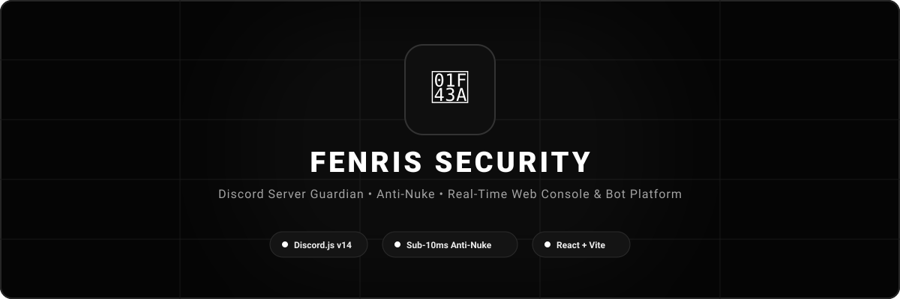

# 🐺 Fenris — Discord Server Security &amp; Web Platform

<p align="center">
  
</p>

<p align="center">
  <a href="https://discord.js.org"></a>
  <a href="https://react.dev"></a>
  <a href="https://vitejs.dev"></a>
  <a href="https://tailwindcss.com"></a>
  <a href="https://expressjs.com"></a>
  <a href="https://www.typescriptlang.org"></a>
</p>

---

## 📖 Overview

**Fenris** is a modern, full-stack Discord management platform and security bot designed for high-consequence servers. It combines a **sub-10ms automated anti-nuke tripwire engine** with a **minimalist, sleek monochrome web management console** and a **public documentation website**.

Whether you are safeguarding a growing gaming guild or managing an enterprise community, Fenris provides automated role escalation interception, phishing link suppression, 3-strike disciplinary ladders, and instant direct-message alerts to registered staff.

---

## ⚡ Key Capabilities

### 🛡️ Real-Time Anti-Nuke Engine
- **Sub-10ms Tripwire Enforcement**: Monitors mass channel deletions, unauthorized webhook creation, and bot invitations.
- **Automated Privilege Revocation**: Strips administrative permissions from malicious or compromised accounts instantly.
- **Rollback Capabilities**: Caches channel and permission manifests to restore server structures immediately.

### ⚖️ Multi-Tier Disciplinary Matrix
- **3-Tier Strike Escalation**:
  - **Tier 1 (Strike 1)**: 24-hour channel timeout + DM infraction notification.
  - **Tier 2 (Strike 2)**: 3-day server mute + staff review queue.
  - **Tier 3 (Strike 3)**: Automated 7-day server ban + incident audit log.
- **One-Click Channel Purge**: Bulk cleans chat spam while preserving pinned announcements.

### 🌐 Sleek Monochrome Web Console
- **Linear Telemetry Ledger**: Unified full-width metrics replacing clunky dashboard tiles with high-contrast, distraction-free indicators.
- **Interactive Discord Feed Simulator**: Live preview of Discord embeds, moderation notices, and audit entries directly in the browser with audio chimes.
- **Interactive Breach Simulator**: Safely triggers controlled tests for role escalation defenses and channel tampering without risking server downtime.

---

## 🚀 24/7 Hosting Guide (Run Without Your PC)

To keep both the Discord bot and web console running **24/7/365 without keeping your computer on**, choose any of the options below:

### Option 1: Railway.app (Recommended — Quickest Setup)
1. Fork or push this repository to your **GitHub** account.
2. Sign in to [Railway.app](https://railway.app) and click **"New Project"**.
3. Select **"Deploy from GitHub repo"** and choose your repository.
4. In Railway Settings under **Variables**, configure:
   ```env
   DISCORD_BOT_TOKEN=your_discord_bot_token_here
   PORT=3000
   NODE_ENV=production
   ```
5. Railway will automatically build and keep your app online 24/7, providing a live `.up.railway.app` URL.

---

### Option 2: Render.com
1. Create a free account on [Render.com](https://render.com).
2. Click **"New +"** → **"Web Service"**.
3. Connect your GitHub repository.
4. Set the following build settings:
   - **Environment**: `Node`
   - **Build Command**: `npm install && npm run build`
   - **Start Command**: `npm run start`
5. Add your `DISCORD_BOT_TOKEN` in the **Environment Variables** section and click **Deploy**.

---

### Option 3: Dedicated Linux VPS (Ubuntu / Debian + PM2)
If you run an AWS EC2, DigitalOcean Droplet, Hetzner VPS, or Oracle Cloud Always Free instance:

1. **Install Node.js & PM2**:
   ```bash
   sudo apt update && sudo apt install -y git curl
   curl -fsSL https://deb.nodesource.com/setup_20.x | sudo -E bash -
   sudo apt install -y nodejs
   sudo npm install -g pm2
   ```

2. **Clone & Build**:
   ```bash
   git clone https://github.com/<your-username>/fenris-bot.git
   cd fenris-bot
   npm install
   npm run build
   ```

3. **Configure Environment**:
   ```bash
   cp .env.example .env
   nano .env # Add your DISCORD_BOT_TOKEN
   ```

4. **Start 24/7 Service**:
   ```bash
   pm2 start dist/server.cjs --name "fenris-bot"
   pm2 startup
   pm2 save
   ```

---

### Option 4: Google Cloud Run
1. In Google AI Studio, click **Deploy to Cloud Run**.
2. Set **Minimum Instances = 1** in the Cloud Run service revision settings (ensures the container doesn't scale to zero so the Discord Gateway WebSocket remains permanently connected).

---

## 🤖 Discord Developer Portal Setup

1. Head to the [Discord Developer Portal](https://discord.com/developers/applications).
2. Click **"New Application"** and name it **Fenris**.
3. Navigate to the **"Bot"** tab:
   - Click **"Reset Token"** and copy your token into `DISCORD_BOT_TOKEN`.
   - Under **Privileged Gateway Intents**, enable:
     - ✅ **Presence Intent**
     - ✅ **Server Members Intent**
     - ✅ **Message Content Intent**
4. Navigate to **OAuth2** → **URL Generator**:
   - Scopes: `bot`, `applications.commands`
   - Bot Permissions: `Administrator` (or `Manage Roles`, `Manage Channels`, `Kick Members`, `Ban Members`, `Manage Messages`, `Send Messages`, `Embed Links`, `Read Message History`).
   - Open the generated URL in your browser to invite Fenris to your Discord server.

---

## 💻 Local Development

### Prerequisites
- Node.js 18+ or 20+
- npm 9+

### Quick Start
```bash
# 1. Clone the repository
git clone https://github.com/<your-username>/fenris-bot.git
cd fenris-bot

# 2. Install dependencies
npm install

# 3. Create your environment file
cp .env.example .env

# 4. Start development server (Port 3000)
npm run dev
```

Visit `http://localhost:3000` to open the web dashboard.

---

## 📁 Project Architecture

```
├── public/                     # Static assets & banner graphics
│   ├── banner.svg              # High-contrast repository header
│   └── favicon.svg             # Wolf icon favicon
├── src/
│   ├── components/
│   │   ├── Header.tsx          # Top bar with ping, shard, and status pills
│   │   ├── Navigation.tsx      # Tab switcher
│   │   ├── landing/            # Public showcase landing website
│   │   └── tabs/               # Management modules
│   │       ├── OverviewTab.tsx # Sleek monochrome server telemetry
│   │       ├── ModerationTab.tsx # Staff sanction console & purge tools
│   │       ├── AuditLogsTab.tsx # Live audit ledger & search filters
│   │       ├── AntiNukeTab.tsx # Real-time tripwires & lockdown triggers
│   │       └── DiscordChannelPreview.tsx # In-browser simulated chat feed
│   ├── types.ts                # TypeScript interfaces & state definitions
│   ├── App.tsx                 # Root application view router
│   └── main.tsx                # Client entry point
├── server.ts                   # Express server & Discord.js bot gateway
├── package.json                # Dependencies & build scripts
└── vite.config.ts              # Vite & Tailwind compilation configuration
```

---

## 🔧 Environment Variables

| Variable | Required | Description | Default |
| :--- | :---: | :--- | :--- |
| `DISCORD_BOT_TOKEN` | Optional | Discord bot token from Developer Portal | Fallback simulation mode |
| `PORT` | Optional | Port for Express & Vite web server | `3000` |
| `NODE_ENV` | Optional | Application runtime environment | `development` |

---

## 📤 Publishing to GitHub

### Method : Manual Git Push
```bash
git init
git add .
git commit -m "feat: complete Fenris Discord security platform & sleek console"
git branch -M main
git remote add origin https://github.com/<your-username>/fenris-bot.git
git push -u origin main
```

---

## 📜 License

Distributed under the **MIT License**. Feel free to customize and deploy for personal or commercial Discord communities.
